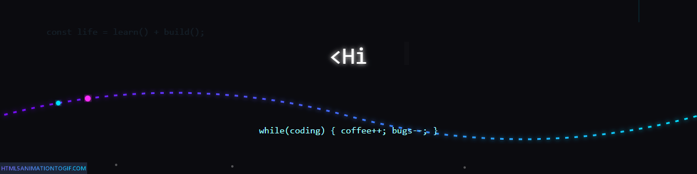

  

I'm a passionate aspiring frontend developer, recently transitioned from an analyst role to pursue my love for coding and UI design. My technical skills include **JavaScript**, **React.js**, and **[...]

I'm eager to collaborate with like-minded individuals—feel free to reach out at 📧 raonidhishree@gmail.com.

**Interests:** Fitness 🏋️‍♀️, Art 🎨

## Skills 💻

  
  
  
  
  
  
  
  

## Coding Profiles 👩‍💻

  

  

## Projects 🚀

- **Frontend Projects:** Building responsive and interactive web applications with React and Tailwind CSS
- **Learning Projects:** Hands-on projects to master JavaScript, React hooks, and modern web development
- Check out my repositories for detailed project code and implementations

